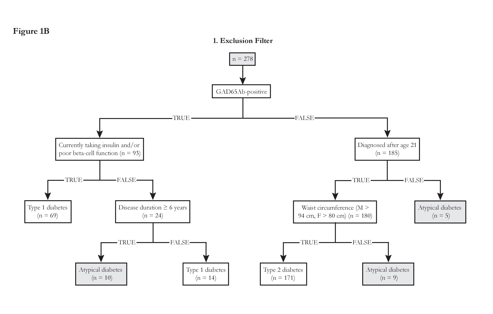
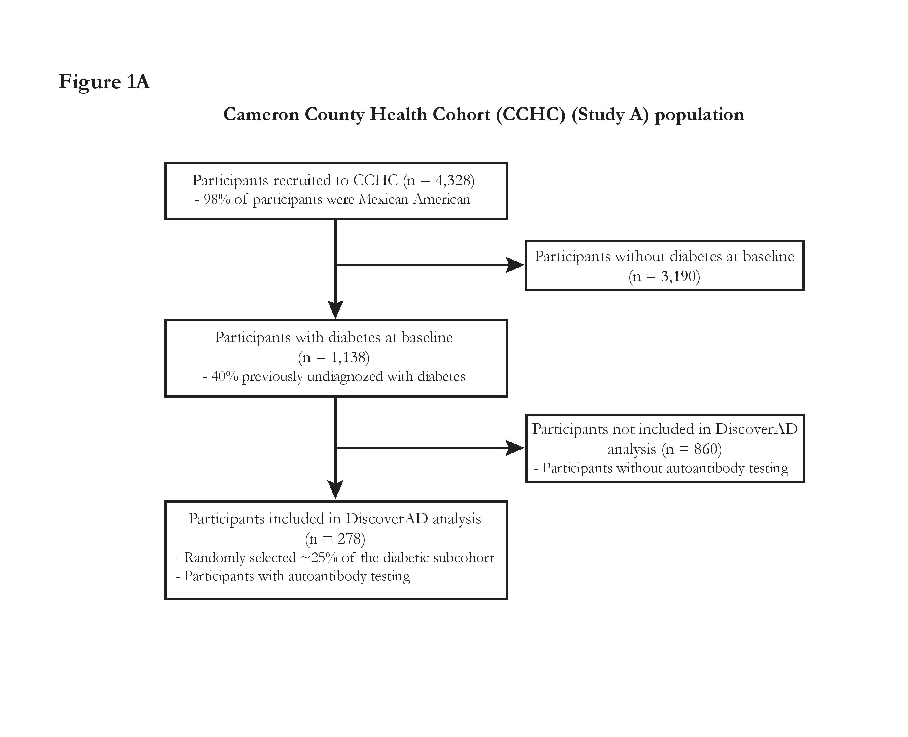
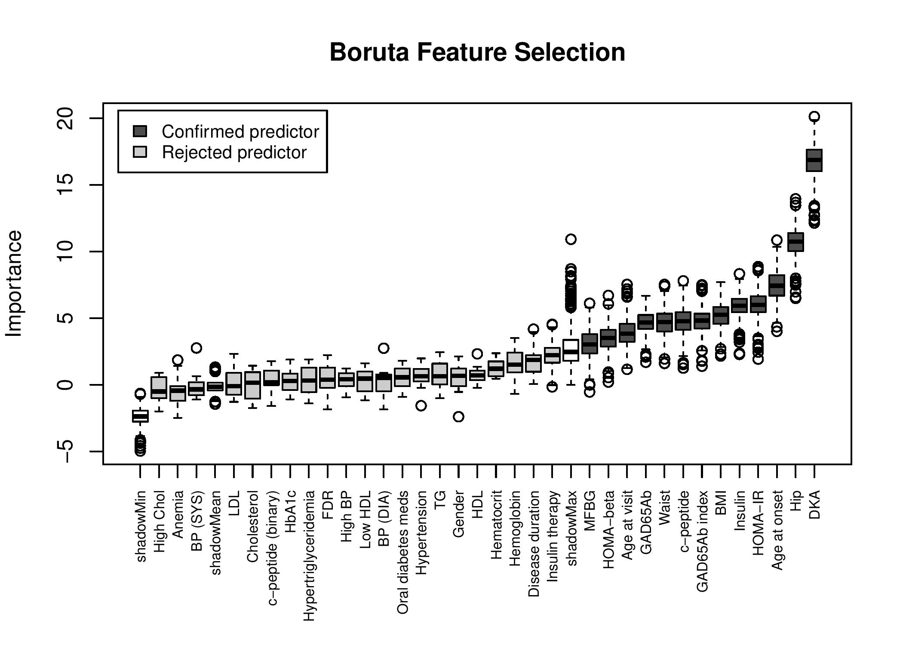
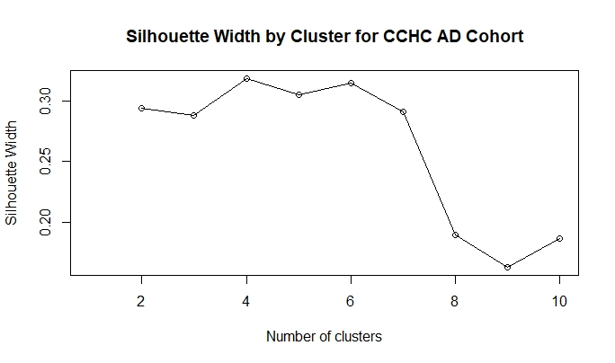
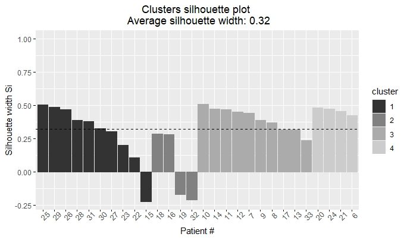
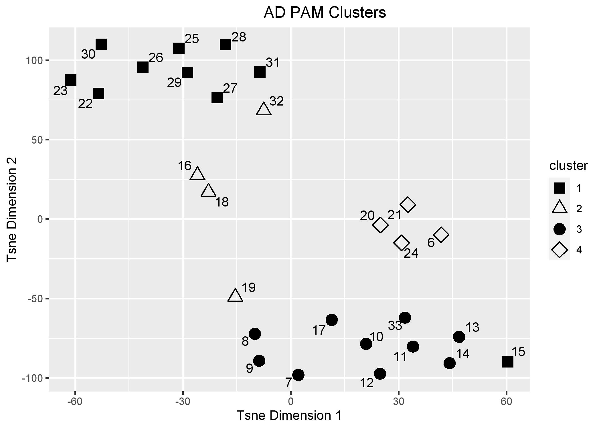

DiscoverAD Tutorial
================
Cassandra Remedios
2021-01-21

  - [Introduction](#introduction)
  - [Requirements](#requirements)
  - [Input Data](#input-data)
  - [Generate additional flag
    variables](#generate-additional-flag-variables)
      - [Autoimmunity and Beta cell function
        metrics](#autoimmunity-and-beta-cell-function-metrics)
      - [Metabolic Syndrome metrics](#metabolic-syndrome-metrics)
      - [Miscellaneous variables](#miscellaneous-variables)
  - [Filtering](#filtering)
      - [Exclusion Filter](#exclusion-filter)
      - [Inclusion Filter](#inclusion-filter)
  - [Cluster Analysis](#cluster-analysis)
      - [Cluster Data Prep](#cluster-data-prep)
      - [Feature Selection](#feature-selection)
      - [Clustering](#clustering)
  - [References](#references)

## Introduction

Discover Atypical Diabetes (DiscoverAD) was developed for identifying
and clustering endotypes of atypical diabetes. DiscoverAD is a data
mining framework with a two-step filtering process to first exclude
participants who meet definitions of typical type 1 diabetes (T1D) or
type 2 diabetes (T2D) and then include participants with certain
pre-specified AD characteristics. This is followed by robust and
unsupervised cluster analysis to discover novel endotypes of AD within
the filtered group. We purposefully developed DiscoverAD to permit
flexibility and efficiency so it can be applicable for various clinical
settings with different types of large cohort datasets.

## Requirements

``` r
library(tidyverse)
library(Boruta)
library(Amelia)
library(cluster)
library(Rtsne)
library(ggrepel)
library(factoextra)
```

## Input Data

The main input file for DiscoverAD is a flat file containing
cross-sectional patient data.

``` r
#Read in input file
dat<-read.table("DiscoverAD_sample_data.tsv", sep="\t", stringsAsFactors = F, header = T)
head(dat, n = 3)
```

    ##   insulin GAD65Ab.index HEIGHT WEIGHT1 WAIST   HIP DIABETIC INSULTAK INSULNOW
    ## 1    13.3     0.0136968  156    69.6  93.1 112.1        1        2       NA
    ## 2    18.6     0.0115212  155.8   134 134.0 136.0        1        1       NA
    ## 3    21.3     0.0616032  153.6    75.6 107 101.0        1        1       NA
    ##   POP PIP CORRSYS1 CORRDIA1 HIGHBP HI_CHOL  HGB      GHB CHOL1 trig hdlc
    ## 1 137 175      122       67      1       1 12.9 4.330000   167  100   60
    ## 2 108 153      140       61      1       1 14.1 9.597385   172  425   21
    ## 3  NA  NA      119       69      2       2 14.0 6.100000   153  191   29
    ##   ldlcalc BMI1 Obese_cat  MFBG MMOL_GLUC FBG_lt100   HOMA_IR HOMA_beta
    ## 1      80 28.2         2 109.0     6.009        NA  3.595582  96.90000
    ## 2     101 42.1         3 364.0    19.003        NA 16.402266  23.01521
    ## 3      84 33.0         3  97.4     5.445        NA  5.580414  97.90000
    ##   HOMAIR_ABNORMAL RACE AGEDIAB AGE_AT_VISIT KETOACID  HCT FADIAB MODIAB
    ## 1               1   NA      54           63        0 40.7      2      2
    ## 2               1   NA      50           54        0 44.1      2      1
    ## 3               1   NA      39           59        0 42.0      3      3
    ##   BIOSDIAB MCORRSYS MCORRDIA c.peptide.ng.ml age gender disease_duration
    ## 1        3      117       72            2.51  63      2                9
    ## 2        2      131       63            4.45  54      1                4
    ## 3        0      121       69            3.84  59      1               20
    ##   insulin_use diabmed first_deg_family
    ## 1           0       0                1
    ## 2           0       0                1
    ## 3           0       0                0

Additionally, we have a file that contains the the types of each
variable included in the main input file, which will be used later for
clustering.

  - I: Interval
  - N: Nominal
  - AB: Asymmetric binary
  - SB: Symmetric binary

<!-- end list -->

``` r
#Read in variable type file
var_type<-read.table("variable_type.tsv", sep="\t", stringsAsFactors = F, header = T)
head(var_type, n = 5)
```

    ##        Variable Type
    ## 1       insulin    I
    ## 2 GAD65Ab.index    I
    ## 3         WAIST    I
    ## 4           HIP    I
    ## 5      CORRSYS1    I

## Generate additional flag variables

### Autoimmunity and Beta cell function metrics

``` r
#Label patients c-peptide levels as high (0) (>=1.0) or low (<1.0) (c.peptide.ng.ml)
dat$c_peptide<-ifelse((dat$c.peptide.ng.ml<1),1,NA)
dat$c_peptide[(dat$c.peptide.ng.ml>=1)]<-0

#Label as Ab positive if:
# GAD65Ab >0.05 (GAD65Ab.index)
dat$Ab_pos<-ifelse(dat$GAD65Ab.index>.05, 1,0)
```

### Metabolic Syndrome metrics

``` r
#Label patient with weight class (3=obese, 2=overweight, 1=normal)
#Waist circumference >102cm (men) or >88cm (women) (WAIST)
dat$weight_class<-ifelse(((dat$gender=="1" & dat$WAIST>102) | (dat$gender=="2" & dat$WAIST>88)),3,
                         ifelse(((dat$gender=="1" & dat$WAIST>94) | (dat$gender=="2" & dat$WAIST>80)),2,1))

#Set weight class to ordinal variable
dat$weight_class<-ordered(dat$weight_class)

#Label patients with hypertriglyceridemia
#Triglyceride levls >1.7 mmol/L (150.569)
dat$hypertriglyceridemia <- ifelse(dat$trig>150.569,1,0)

#Label patients with low HDL
# HDL <1.03 mmol/L (39.8301) (men) or <1.29 mmol/L (49.8843) (women)
dat$lowHDL<-ifelse(((dat$gender=="1" & dat$hdlc<39.8301) | (dat$gender=="2" & dat$hdlc<49.8843)),1,0)

#Label patients with hypertension (high blood pressure)
# Blood pressure >130/85 mmHg (mcorrsys, mcorrdia)
# Self-reported hypertension (highbp)
dat$hypertension <- ifelse((dat$MCORRSYS>=130 | dat$MCORRDIA>=85 | (dat$HIGHBP==1 & !is.na(dat$HIGHBP))),1,0)

#Label patients with high fasting plasma glucose (>=5.6) or if diabetic
dat$high_fbg<-ifelse(dat$MFBG>=100.8,1,0)
dat$high_fbg<-1


#Label patients with MetS if:
#Waist circumfrence >102cm (men) or >88cm(women) (WAIST)
#And two of the following criteria:
#Hypertriglyceridemia (>1.7 mmol/L (150.569mg/dL))(trig)
#Low HDL ((<1.03 mmol/L (39.8301mg/dL) men, <1.29 mmol/L (49.8843mg/dL) women)) (HDL, meds)
#Hypertension (Systolic bp >= 130mmHg or Diastolic >=85mmHg) (CORRSYS1,CORRDIA1)
#fasting blood glucose >= 5.6 mmol/L (100.8 mg/dL)

for (i in 1:nrow(dat)){
  temp_sum<-sum(dat[i,"hypertriglyceridemia"],dat[i,"lowHDL"],dat[i,"hypertension"],dat[i,"high_fbg"], na.rm = TRUE)
  dat[i,"MetS_sum"]<-temp_sum
  if (dat[i,"weight_class"]==3 & !is.na(dat[i,"weight_class"]) & temp_sum>=2){
    dat[i,"MetS"]<-1
  }
  else {
    dat[i,"MetS"]<-0
  }
}

#Set MetS_sum to ordinal variable
dat$MetS_sum<-ordered(dat$MetS_sum)
```

### Miscellaneous variables

``` r
#Label as young diagnosis if:
# age of patient at diagnosis (age) was under 21, assign 1 to 'young_diag'
dat$young_diag<-ifelse(dat$age<=21,1,0)

#Label anemic patients
# If low hemoglobin (hgb):
#   Male: <13.5g/dl
#   Female: <12g/dl
# If low hematocrit (hct):
#   Male: 38.8%
#   Female: <34.9%
dat$anemia <- ifelse((((dat$gender==1 & dat$HGB<13.5) | (dat$gender==2 & dat$HGB<12)) & ((dat$gender==1 & dat$HCT<38.8)|(dat$gender==2 & dat$HCT<34.9))),1,0)
```

## Filtering

Filtering is performed on the dataset to identify atypical patients. We
first exclude typical type 1 and type 2 patients, and then include known
AD phenotypes.

<p align="center">


</p>

### Exclusion Filter

The first step in DiscoverAD is an exclusion filter to first exclude
participants who meet definitions of typical T1D or T2D.

In this example we define typical T1D as:

1.  Patient is autoantibody positive for GAD65 AND
2.  Patient has poor beta cell function as measured by HOMA-beta or a
    short duration of disease (\<6 years)

<!-- end list -->

``` r
#Set a default value for diabetes type
dat$type<-0

#Label patient as Type 1 if:
# patient is autoantibody positive (Ab_pos) AND
# patient is currently taking insulin (insulin_use) OR patient has poor beta cell function
# OR
# patient is autoantibody positive (Ab_pos) AND patient has a c-peptide score <1
dat$type[dat$Ab_pos==1 & (dat$insulin_use==1 | dat$HOMA_beta<=50 | dat$disease_duration<6)]<-1
```

In this example we define typical T2D as:

1.  Patient is autoantibody negative for GAD65 AND
2.  Patient is overweight as measured by waist circumference

<!-- end list -->

``` r
#Label patient with Type 2 if:
# patient is autoantibody negative (AB_pos) AND
# patient age at diagnosis >= 21 (age) AND
# waist circumference >94cm for men or >80cm for women

dat$type[dat$Ab_pos==0 & dat$age>21 & ((dat$gender=="1" & dat$WAIST>94) | (dat$gender=="2" & dat$WAIST>80))]<-2
```

Participants who do not meet the typical definitions for T1D or T2D are
flagged as atypical

``` r
dat$type[dat$type==0]<-3

#Add exclusion filter flag
dat$exclusion<-ifelse(dat$type==3, 1, 0)
```

### Inclusion Filter

The next step is to include participants with previously known AD
characteristics. In this example, that includes the atypical forms of
Ketosis-Prone Diabetes(KPD) previously defined by Balasubramanyam et.
al. (2006).

``` r

dat$inclusion <- 0

#Include A+/B+ KPD participants
dat$type[dat$Ab_pos==1 & dat$HOMA_beta>=50 & dat$KETOACID==1]<-3
dat$inclusion<-ifelse(dat$Ab_pos==1 & dat$HOMA_beta>=50 & dat$KETOACID==1, 1, dat$inclusion)

#Include A-/B+ KPD participants
dat$type[dat$Ab_pos==0 & dat$HOMA_beta>=50 & dat$KETOACID==1]<-3
dat$inclusion<-ifelse(dat$Ab_pos==0 & dat$HOMA_beta>=50 & dat$KETOACID==1, 1, dat$inclusion)

#Include A-/B- KPD participants
dat$type[dat$Ab_pos==0 & dat$HOMA_beta<50 & dat$KETOACID==1]<-3
dat$inclusion<-ifelse(dat$Ab_pos==0 & dat$HOMA_beta<50 & dat$KETOACID==1, 1, dat$inclusion)
```

## Cluster Analysis

Cluster analysis is performed on the data from the filtered AD
participants to identify endotypes of AD that share phenotypic
characteristics.

### Cluster Data Prep

``` r
#Create a binary atypical identification flag
dat$atypical <- ifelse(dat$type==3,1,0)

#Reduce data to only relevant variables for clustering
dat_fs<-dat[, colnames(dat) %in% c(var_type$Variable, "atypical")]

#Reduce data to only potential atypical participants and potential variables for clustering to relevant ones
dat_cluster<-dat[which(dat$atypical==1), colnames(dat) %in% var_type$Variable]

#Set gender to factor
dat_cluster$gender<-as.factor(dat_cluster$gender)
```

### Feature Selection

Variables for clustering are selected using the Boruta algorithm.
Feature selection is run using the atypical identification from the
filtering steps as the dependent variable (i.e., AD vs. T1D or T2D). The
Boruta algorithm requires there not to be any missing values in the
dataset, and so the missing data is imputed using the Amelia package.

#### Imputation

The Boruta algorithm requires there not to be any missing values in the
dataset, and so the missing data is imputed using the Amelia package.

``` r
set.seed(123)

#Impute missing values
dat_fs_imputed <- amelia(dat_fs, m=1, parallel = "multicore")
```

#### Boruta Feature Selection

``` r
boruta_selection<- Boruta(atypical~., data = dat_fs_imputed$imputations[[1]], doTrace = 2, maxRuns=500)


gscale<-c("#4D4D4D", "#4D4D4D","#CCCCCC")
plot(boruta_selection, xlab = "", xaxt = "n", col=gscale[as.numeric(boruta_selection$finalDecision)], family="G")
lz<-lapply(1:ncol(boruta_selection$ImpHistory),function(i)
  boruta_selection$ImpHistory[is.finite(boruta_selection$ImpHistory[,i]),i])
names(lz) <- unlist(lapply(colnames(boruta_selection$ImpHistory), str_remove_all, "`"))
Labels <- sort(sapply(lz,median))
axis(side = 1,las=2,labels = names(Labels),
     at = 1:ncol(boruta_selection$ImpHistory), cex.axis = 0.7)
legend("topleft", inset=0.02, legend=c("Confirmed predictor", "Rejected predictor"), fill=gscale[2:3], cex=0.8)
title("Boruta Feature Selection")

```
<p align="center">

</p>

``` r
#Decide on tentative variables
boruta_selection<-TentativeRoughFix(boruta_selection)

## Warning in TentativeRoughFix(boruta_selection): There are no Tentative
## attributes! Returning original object.

boruta_variables<-unlist(lapply(getSelectedAttributes(boruta_selection), str_remove_all, "`"))

#Filter dat_cluster to only boruta selected variables
dat_cluster<-dat_cluster[,colnames(dat_cluster) %in% boruta_variables]
```

### Clustering

The cluster analysis starts by generating a dissimilarity matrix for the
feature-selected data using Gower’s Similarity Coefficient with the
daisy function from the R package cluster \[version 2.06\]. This matrix
is generated by the computation of pairwise dissimilarities between
standardized observations within the dataset and permitted missing
values without requiring imputation of missing data. Gower’s Similarity
Coefficient permits the computation of dissimilarities between the mixed
variable data types inherent to different types of clinical datasets.

``` r
#Generate vector containing the variable types
ab<-c()
sb<-c()

for (k in 1:ncol(dat_cluster)){
  var1<-colnames(dat_cluster[k])
  binary_type<-var_type[which(var_type$Variable==var1), "Type"]
  if (!is.na(binary_type) & binary_type=="SB"){
    sb<-c(sb, k)
  }
  else if (!is.na(binary_type) & binary_type=="AB"){
    ab<-c(ab, k)
  }
}

type1<-c()

if (!is.null(sb) & !is.null(ab)){
  type1<-list(asymm=ab, symm=sb)
}
if (!is.null(sb) & is.null(ab)){
  type1<-list(symm=sb)
}
if (is.null(sb) & !is.null(ab)){
  type1<-list(asymm=ab)
}

#Create dissimiliarity matrix
gower.daisy.mat<-daisy(dat_cluster, metric="gower", stand= TRUE, type=type1)
```

Next, we find the number of clusters (k) for extraction by the k-medoid
clustering algorithm using the greatest average silhouette width of the
AD dataset from k = 1 to 10 using the R package Cluster. A silhouette
width is a measure of how similar an object is to its own cluster
compared to other clusters.

``` r
#Function to generate silhouette width plots
silwidth<-function(daisy.mat, plot_name){
  sil_width <- c(NA)

  for(i in 2:10){

    pam_fit <- pam(daisy.mat,
                   diss = TRUE,
                   k = i)

    sil_width[i] <- pam_fit$silinfo$avg.width

  }

  # Plot sihouette width (higher is better)
  plot(1:10, sil_width,
       xlab = "Number of clusters",
       ylab = "Silhouette Width",
       main = "Silhouette Width by Cluster for CCHC AD Cohort")
  lines(1:10, sil_width)

  #Return best number of clusters
  best_k<-match(max(sil_width, na.rm = TRUE), sil_width)
  return(best_k)
}

best_k<-silwidth(gower.daisy.mat,'Atypical_sil_width')
```
<p align="center">

</p>

``` r
print(paste0("Silhouette Width: ", best_k, " clusters"))
```

    ## [1] "Silhouette Width: 4 clusters"

Next, we take the gower dissimilarity matrix and the number of clusters
(k) and cluster the subjects using Partitioning Around Medoids (PAM).

``` r
#Run PAM clustering using gower matrix and silhouette-derived best k number of clusters
Atypical_pam_fit <- pam(gower.daisy.mat, diss = TRUE, k = best_k)

#Plot silhouette widths of individual clusters (Supplemental Figure 1B)
s<-fviz_silhouette(Atypical_pam_fit, label=TRUE) + 
  theme(plot.title = element_text(hjust = 0.5)) +
  scale_fill_grey() +
  scale_color_grey() +
  xlab("Patient #") +
  geom_hline(yintercept=Atypical_pam_fit$silinfo["avg.width"]$avg.width, linetype="dashed") +
  theme(title = element_text(family = 'Arial'))

plot(s)
```

<p align="center">

</p>

We can visualize the clusters using t-distributed stochastic neighbor
embedding (t-SNE).

``` r
#Generate visual representation of cluster for Atypical
tsne_obj <- Rtsne(gower.daisy.mat, is_distance = TRUE, perplexity=6)

tsne_data <- tsne_obj$Y %>%
  data.frame() %>%
  setNames(c("X", "Y")) %>%
  mutate(cluster = factor(Atypical_pam_fit$clustering),
         name = dat_cluster$BDVISIT,
         pid = names(Atypical_pam_fit$clustering))

tsne<-ggplot(aes(x = X, y = Y), data = tsne_data) + 
  geom_point(aes(shape=cluster), size=4) +
  scale_shape_manual(values=c(15,2,19,5)) +
  labs(fill="Cluster") +
  xlab("Tsne Dimension 1") +
  ylab("Tsne Dimension 2") +
  ggtitle("AD PAM Clusters") +
  theme(plot.title = element_text(hjust = 0.6)) + 
  theme(title = element_text(family = 'Arial')) +
  geom_text_repel(aes(label=pid), point.padding = .25)
plot(tsne)
```

<p align="center">

</p>

To differentiate the clusters, we can look at the summary statistics for
each cluster.

``` r
Atypical_pam_results <- dat_cluster %>%
  mutate(cluster = Atypical_pam_fit$clustering) %>%
  group_by(cluster) %>%
  do(the_summary = summary(.))

print(Atypical_pam_results$the_summary)
```

```
[[1]]
    insulin      GAD65Ab.index         WAIST            HIP              BMI1            MFBG          HOMA_IR        HOMA_beta       AGE_AT_VISIT     KETOACID  
 Min.   : 6.80   Min.   :0.02966   Min.   : 82.3   Min.   : 90.70   Min.   :22.10   Min.   : 95.0   Min.   :2.277   Min.   : 17.95   Min.   :21.0   Min.   :0.0  
 1st Qu.: 9.10   1st Qu.:0.03957   1st Qu.: 92.6   1st Qu.: 93.75   1st Qu.:25.52   1st Qu.:103.2   1st Qu.:2.611   1st Qu.: 39.09   1st Qu.:52.0   1st Qu.:0.0  
 Median :10.20   Median :0.06312   Median :104.0   Median :104.00   Median :30.50   Median :113.5   Median :2.804   Median : 69.96   Median :61.5   Median :0.0  
 Mean   :11.30   Mean   :0.07737   Mean   :104.5   Mean   :106.92   Mean   :30.61   Mean   :134.3   Mean   :3.590   Mean   : 65.50   Mean   :58.0   Mean   :0.2  
 3rd Qu.:11.93   3rd Qu.:0.07974   3rd Qu.:111.0   3rd Qu.:111.28   3rd Qu.:31.95   3rd Qu.:152.8   3rd Qu.:4.775   3rd Qu.: 95.20   3rd Qu.:66.5   3rd Qu.:0.0  
 Max.   :21.90   Max.   :0.19063   Max.   :132.0   Max.   :135.00   Max.   :43.30   Max.   :248.0   Max.   :6.409   Max.   :100.00   Max.   :83.0   Max.   :1.0  
                                                                                                                                                                 
 c.peptide.ng.ml consensus_age       Ab_pos       Cluster       cluster 
 Min.   :2.080   Min.   :15.00   Min.   :0.0   Min.   :1.0   Min.   :1  
 1st Qu.:2.580   1st Qu.:41.00   1st Qu.:0.0   1st Qu.:1.0   1st Qu.:1  
 Median :2.880   Median :47.00   Median :1.0   Median :1.5   Median :1  
 Mean   :3.052   Mean   :46.67   Mean   :0.6   Mean   :2.0   Mean   :1  
 3rd Qu.:3.460   3rd Qu.:55.00   3rd Qu.:1.0   3rd Qu.:3.0   3rd Qu.:1  
 Max.   :4.240   Max.   :63.00   Max.   :1.0   Max.   :4.0   Max.   :1  
                 NA's   :1                                              

[[2]]
    insulin       GAD65Ab.index         WAIST             HIP             BMI1            MFBG          HOMA_IR          HOMA_beta       AGE_AT_VISIT      KETOACID
 Min.   : 1.800   Min.   :0.02377   Min.   : 89.00   Min.   : 94.0   Min.   :24.70   Min.   : 95.0   Min.   : 0.7199   Min.   : 4.031   Min.   :32.00   Min.   :0  
 1st Qu.: 2.775   1st Qu.:0.03189   1st Qu.: 90.50   1st Qu.: 97.0   1st Qu.:26.65   1st Qu.:144.5   1st Qu.: 0.9258   1st Qu.:10.680   1st Qu.:44.00   1st Qu.:0  
 Median : 7.550   Median :0.03668   Median : 97.50   Median :102.0   Median :28.30   Median :193.5   Median : 4.4328   Median :24.419   Median :54.00   Median :0  
 Mean   : 9.225   Mean   :0.04310   Mean   : 99.78   Mean   :104.0   Mean   :28.62   Mean   :221.0   Mean   : 5.3444   Mean   :31.892   Mean   :51.25   Mean   :0  
 3rd Qu.:14.000   3rd Qu.:0.04789   3rd Qu.:106.78   3rd Qu.:109.1   3rd Qu.:30.27   3rd Qu.:270.0   3rd Qu.: 8.8513   3rd Qu.:45.631   3rd Qu.:61.25   3rd Qu.:0  
 Max.   :20.000   Max.   :0.07527   Max.   :115.10   Max.   :118.1   Max.   :33.20   Max.   :402.0   Max.   :11.7920   Max.   :74.697   Max.   :65.00   Max.   :0  
 c.peptide.ng.ml consensus_age       Ab_pos        Cluster        cluster 
 Min.   :0.56    Min.   :18.00   Min.   :0.00   Min.   :1.00   Min.   :2  
 1st Qu.:1.79    1st Qu.:30.00   1st Qu.:0.00   1st Qu.:1.75   1st Qu.:2  
 Median :2.24    Median :34.50   Median :0.00   Median :2.50   Median :2  
 Mean   :2.28    Mean   :36.75   Mean   :0.25   Mean   :2.25   Mean   :2  
 3rd Qu.:2.73    3rd Qu.:41.25   3rd Qu.:0.25   3rd Qu.:3.00   3rd Qu.:2  
 Max.   :4.08    Max.   :60.00   Max.   :1.00   Max.   :3.00   Max.   :2  

[[3]]
    insulin       GAD65Ab.index         WAIST            HIP              BMI1            MFBG          HOMA_IR         HOMA_beta        AGE_AT_VISIT     KETOACID  
 Min.   : 1.900   Min.   :0.01691   Min.   : 78.0   Min.   : 87.00   Min.   :17.00   Min.   : 90.0   Min.   : 0.682   Min.   :  5.556   Min.   :23.0   Min.   :0.0  
 1st Qu.: 4.875   1st Qu.:0.03668   1st Qu.: 92.6   1st Qu.: 92.03   1st Qu.:23.35   1st Qu.:102.2   1st Qu.: 1.211   1st Qu.: 31.786   1st Qu.:43.5   1st Qu.:0.0  
 Median : 9.450   Median :0.03933   Median : 97.5   Median :103.00   Median :27.85   Median :126.0   Median : 2.606   Median : 45.580   Median :56.0   Median :0.0  
 Mean   :17.380   Mean   :0.03875   Mean   :103.6   Mean   :107.08   Mean   :29.70   Mean   :135.4   Mean   : 4.751   Mean   : 56.716   Mean   :53.3   Mean   :0.4  
 3rd Qu.:19.150   3rd Qu.:0.04706   3rd Qu.:105.9   3rd Qu.:116.00   3rd Qu.:33.10   3rd Qu.:164.8   3rd Qu.: 4.847   3rd Qu.: 97.826   3rd Qu.:63.0   3rd Qu.:1.0  
 Max.   :75.400   Max.   :0.05075   Max.   :146.7   Max.   :137.40   Max.   :47.20   Max.   :198.0   Max.   :18.615   Max.   :100.000   Max.   :91.0   Max.   :1.0  
                                                                                                                                                                    
 c.peptide.ng.ml consensus_age       Ab_pos       Cluster        cluster 
 Min.   :0.480   Min.   :11.00   Min.   :0.0   Min.   :1.00   Min.   :3  
 1st Qu.:1.160   1st Qu.:22.25   1st Qu.:0.0   1st Qu.:2.25   1st Qu.:3  
 Median :1.720   Median :37.00   Median :0.0   Median :3.00   Median :3  
 Mean   :1.924   Mean   :37.60   Mean   :0.1   Mean   :2.90   Mean   :3  
 3rd Qu.:2.240   3rd Qu.:44.25   3rd Qu.:0.0   3rd Qu.:3.75   3rd Qu.:3  
 Max.   :5.120   Max.   :91.00   Max.   :1.0   Max.   :4.00   Max.   :3  
 NA's   :1                                                               

[[4]]
    insulin     GAD65Ab.index         WAIST             HIP              BMI1            MFBG          HOMA_IR         HOMA_beta       AGE_AT_VISIT    KETOACID
 Min.   : 5.0   Min.   :0.04153   Min.   : 78.00   Min.   : 87.00   Min.   :22.40   Min.   :64.00   Min.   :0.7822   Min.   : 78.31   Min.   :52    Min.   :0  
 1st Qu.: 6.2   1st Qu.:0.04736   1st Qu.: 90.00   1st Qu.: 93.38   1st Qu.:25.02   1st Qu.:72.25   1st Qu.:1.2775   1st Qu.: 94.58   1st Qu.:55    1st Qu.:0  
 Median : 7.0   Median :0.04973   Median : 95.35   Median :100.25   Median :27.60   Median :81.50   Median :1.7727   Median :100.00   Median :58    Median :0  
 Mean   : 7.5   Mean   :0.04979   Mean   : 94.42   Mean   : 99.50   Mean   :26.75   Mean   :81.25   Mean   :1.5239   Mean   : 94.58   Mean   :58    Mean   :0  
 3rd Qu.: 8.3   3rd Qu.:0.05216   3rd Qu.: 99.78   3rd Qu.:106.38   3rd Qu.:29.32   3rd Qu.:90.50   3rd Qu.:1.8947   3rd Qu.:100.00   3rd Qu.:61    3rd Qu.:0  
 Max.   :11.0   Max.   :0.05816   Max.   :109.00   Max.   :110.50   Max.   :29.40   Max.   :98.00   Max.   :2.0167   Max.   :100.00   Max.   :64    Max.   :0  
                                                                                                    NA's   :1                                                  
 c.peptide.ng.ml consensus_age       Ab_pos       Cluster       cluster 
 Min.   :2.360   Min.   :34.00   Min.   :0.0   Min.   :1.0   Min.   :4  
 1st Qu.:2.520   1st Qu.:40.00   1st Qu.:0.0   1st Qu.:1.0   1st Qu.:4  
 Median :2.680   Median :43.50   Median :0.5   Median :1.0   Median :4  
 Mean   :2.933   Mean   :44.25   Mean   :0.5   Mean   :1.5   Mean   :4  
 3rd Qu.:3.220   3rd Qu.:47.75   3rd Qu.:1.0   3rd Qu.:1.5   3rd Qu.:4  
 Max.   :3.760   Max.   :56.00   Max.   :1.0   Max.   :3.0   Max.   :4  
 NA's   :1                                                              

```
 
## References
Balasubramanyam A, Garza G, Rodriguez L, Hampe CS, Gaur L, Lernmark A,
Maldonado MR: Accuracy and predictive value of classification schemes
for ketosis-prone diabetes. Diabetes Care 2006;29:2575-2579

Honaker J, King G, Blackwell M (2011). “Amelia II: A Program for Missing Data.”
Journal of Statistical Software, 45(7), 1–47. http://www.jstatsoft.org/v45/i07/.

Jesse H. Krijthe (2015). Rtsne: T-Distributed Stochastic Neighbor Embedding using a
Barnes-Hut Implementation, URL: https://github.com/jkrijthe/Rtsne

Kamil Slowikowski (2020). ggrepel: Automatically Position Non-Overlapping Text Labels with 'ggplot2'. R package version
0.8.2. https://CRAN.R-project.org/package=ggrepel

Kursa MB, Rudnicki WR (2010). “Feature Selection with the Boruta Package.”
Journal of Statistical Software, 36(11), 1–13. http://www.jstatsoft.org/v36/i11/.

Maechler, M., Rousseeuw, P., Struyf, A., Hubert, M., Hornik, K.(2019). cluster:
Cluster Analysis Basics and Extensions. R package version 2.1.0.

Wickham et al., (2019). Welcome to the tidyverse. Journal of Open
Source Software, 4(43), 1686, https://doi.org/10.21105/joss.01686
